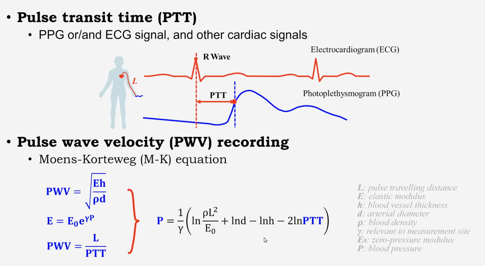
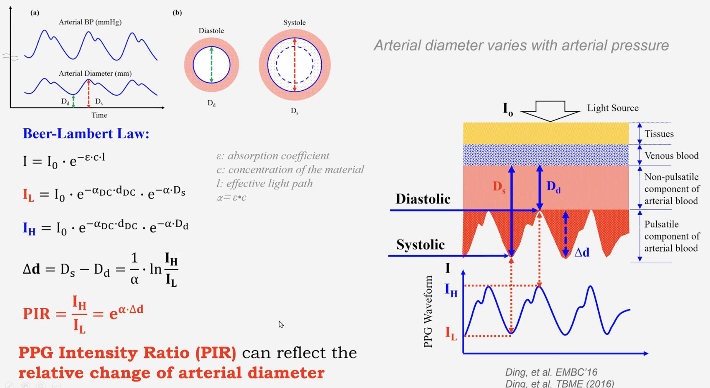
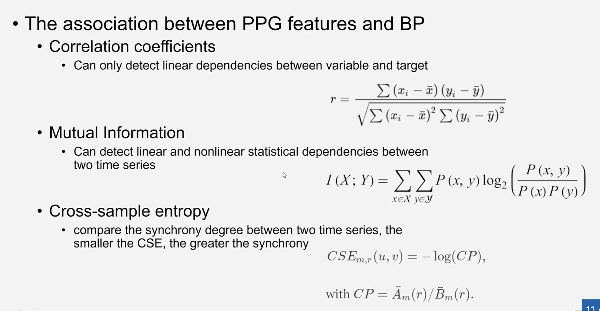
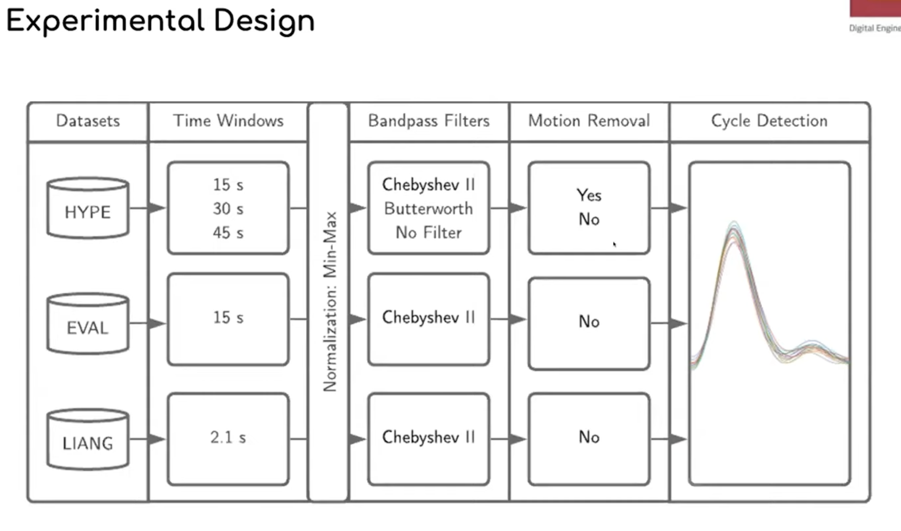

Photoplethysmography (PPG)
It is a method by which we can measure the heart rate. 
Often through an LEN  light of different wavelength 
like green, red or infrared. When the light passes through 
the skin, some of it is abosorbed by the blood and the rest 
is reflected. The sensor than measures the percentage of 
light absorbed, based on which the heart rate is calculated.

It was actually discovered in 1930's, but came into medical 
used by 1980's. in the ICU's. 

When the heart beat's in a body, the amount of blood flow 
increases which inturn will abosrbs more amount of lights 
and during the drop in heart rate the amount of drop in light 
absorbtion drops, this PPG signal actually tells us the heart 
rate of the blood flow.

This can vary with change in different attributes.
- Like if you apply on the smart watch over the wrist, and if 
the wrist is too tight that will block the blood flow whereas 
when it is too low, there might be delay in capturing of light, 
what if lighter skins and darker skin variations, which might 
have different levels of abosroption rate. Instead the blood flow 
at ear vessel is very high, and if you are able to collect PPG signal 
from there of at the tip of the finger over the vessels, that would 
give higher accurate blood flows.

- In most of the time, green lights are used for measurement, which 
has wavelength of 495nm - 570 nm, which goes only up to blood vessels, 
whereas red with wavelength of (650 nm to 950 nm) goes a little deeper, 
whereas infrared > 950 nm goes deepere into skin for different applications 
of medical settings.

Signal Processing
- There can be noises due to movemenet, dure to drift in the 
physical body and so. on.

- While measuring PPG, there arevery high chances that noises 
are included into it. So before processing them we must ensure 
that we clean those signal's, and we use High pass gilter to signal 
out low filters and we use low pass filter to seperate high pass 
filters. It is used only wehn the signals are cleaned of noises.

- Pan Tompkins algorithm uses a series of filters to enhance QRS complex 
frequency content, removed background noise, squares the signal 
to amplify the QRS contribution, and applies adaptive thresholds to 
detect signal peaks.

time interval in betwen peaks - hear rate
Amplitude of PPG - Blood Volume/ Vascular Health

PPG Practical Rules.
- By analyzing the PPF waveform we can not only analyze the Heart but 
many things like, physiological signals like respiratory rate, blood pressure, 
blood oxygen saturation, detect sleep apnea, and determine atrial fibrillation.

- In the calculation of SPO2 from the PPG signal, the emitter 
sends red and infrared lights in to our skin. By comparing the 
absorption rates of red and infrared light, pulse ozimeters can 
determine the ration of oxygenated hemoglobin absorbs more 
infrared light and less red light, while deoxygenated hemoglobin 
absorbs more red light and less infrared light. This ration 
is used to estimate blood oxygen saturation. (SpO2)

- Recording blood pressure using PPG, is quite complex, 
but in coming years we can actually use PPG to calculate 
blood pressure. Combining the PPG data with another signal, 
such as ECG, allows calculation of PTT(pulse transit time). 
Shorter PPT correlated with higher blood pressure, while longer 
PTT correlated with lower blood pressure. Algorithms then 
convert these PTT measurements into blood pressure estimates.

See this very useful: https://bionichaos.com/

Metrices to see the quality of Data
Metric1 : Signal to Noise Ratio
    SNR(db) = 10 log_10(P_fundamental/P_noise)
metric2 : (PI) Perfusion Index = the perfusion index (PI, the ratio of the amplitudes of the pulsatile (AC) and baseline (DC) components, also known as the AC/DC ratio); 
    PI % = 100 * (AC Amplitude/DC Amplitude)
    this tells how strong is pulse relative to the background
Metric3 : (TMCC) a template-matching correlation coefficient (TMCC). These three approaches are now described.
    calculate average (or template pulse shape) from the recording and they calculate aech of them to the template.
    - it is for shape consistency

Based on the research paper what actually affects the PPG Signal Quality
- Posture and height of the sensor relative to your height (SNR is good when lying down, resting arms is good, and standing is the worst)
- Age (Signal quality, increases with Age)
- Skin Tone (darker skin tone absorbs more light)
- Some amart watches adjust's the light based on light and darker tone, so that can be taken care by devices and smart watches.

PPG Webinar by Peter Charlton (https://www.youtube.com/watch?v=j0IKopFhBYA)

Evaluating ML Models, for Blood pressure estimation using PPG.

Datasets: HYPE Dataset from Germany, EVAL Data, LIANG Data

Quality Assessment
