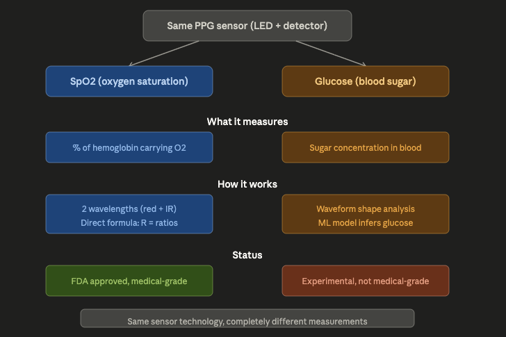

SpO₂ and glucose monitoring are two completely different measurements. They just happen to use the same underlying technology (PPG  light shining into skin). Let me clarify the distinction.
SpO₂ (Pulse Oximetry) measures how much of your hemoglobin is carrying oxygen. It answers: "Is your blood well-oxygenated?" A healthy reading is 95–100%. This is a mature, FDA-approved, highly reliable technology that's been in hospitals since the 1980s.
Glucose monitoring measures the concentration of sugar (glucose) in your blood. It answers: "What is your blood sugar level?" A normal fasting range is roughly 70–100 mg/dL. Non-invasive PPG-based glucose monitoring is still experimental and far less reliable.
They share the same PPG sensor hardware but measure fundamentally different things:

Think of it like this: your smartwatch has an LED and a light detector on the back. That same hardware can be used for multiple purposes, just like a camera can take both photos and videos  but photos and videos are not the same thing.

Here's what each measurement does with that sensor:
SpO₂ uses two specific wavelengths (red 660nm + infrared 940nm), exploits the known, large difference in how oxygenated vs. deoxygenated hemoglobin absorbs at those wavelengths, and calculates oxygen saturation with a clean physics formula (SpO₂ = 110 − 25R). The signal is strong and distinct, which is why it's accurate and clinically trusted.
R = (ac_red / dc_red) / (ac_ir / dc_ir)

Glucose monitoring tries to extract glucose information from the same kind of light signal, but glucose's effect on light absorption is extremely tiny compared to hemoglobin and water. There's no clean formula like Glucose = something × R. Instead, it relies on machine learning to detect subtle patterns in the PPG waveform (slopes, timing, shape) that correlate with glucose levels  an indirect inference, not a direct measurement.
The reason I walked through the SpO₂ formula is that it illustrates how PPG can deliver a precise, physics-based measurement when the target molecule has a strong, distinct optical signature. Glucose simply doesn't have that advantage, which is why non-invasive glucose monitoring remains such a hard unsolved problem.