# Time Series

This project is a study of time series analysis, wearable physiological signals, heart rate estimation, and PPG signal denoising. It starts with basic forecasting concepts, then moves into photoplethysmography applications, and finally builds a more detailed signal processing workflow for wrist based heart rate data.

## Introduction

The Introduction folder covers the main foundations needed for time series forecasting. It explains what time series data is, why trend, seasonality, cycles, variance, residuals, and stationarity matter, and how transformations such as differencing, logarithms, and Box Cox transforms help make data easier to model.

The notes then move through decomposition, autocorrelation, partial autocorrelation, forecasting metrics, baseline forecasting methods, exponential smoothing, Holt linear trend models, Holt Winter seasonal models, autoregression, moving average models, ARIMA, SARIMA, and harmonic regression. The folder also includes images for SARIMA and Fourier series based seasonality modeling.

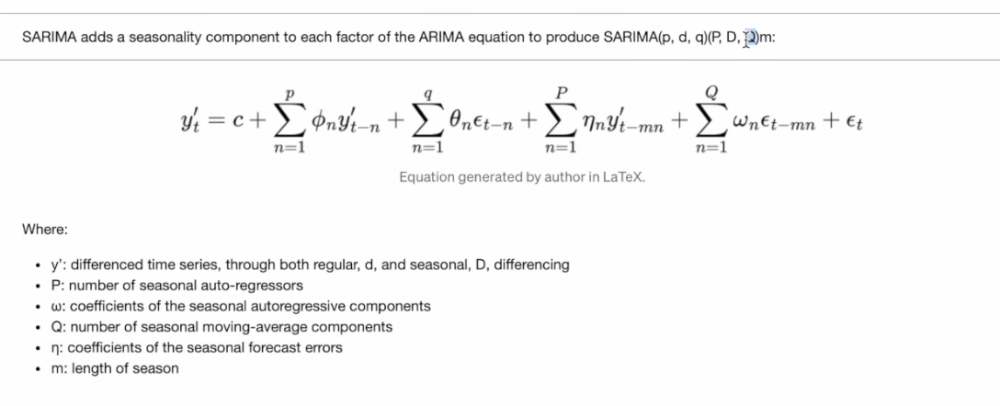

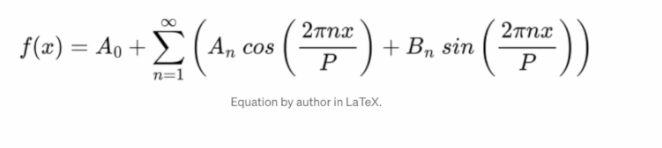

## Applications

The Applications folder focuses on photoplethysmography. It explains how PPG uses light absorption and reflection to estimate blood volume changes, heart rate, oxygen saturation, rhythm patterns, and possible blood pressure relationships. It also covers practical sensor concerns such as wavelength choice, wrist placement, skin tone, posture, pressure, signal quality, and quality metrics such as signal to noise ratio, perfusion index, and template matching.

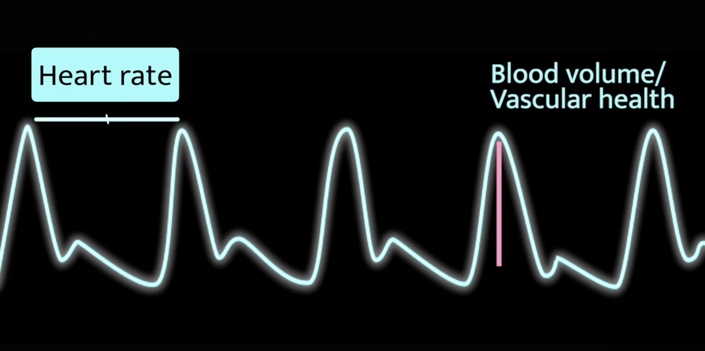

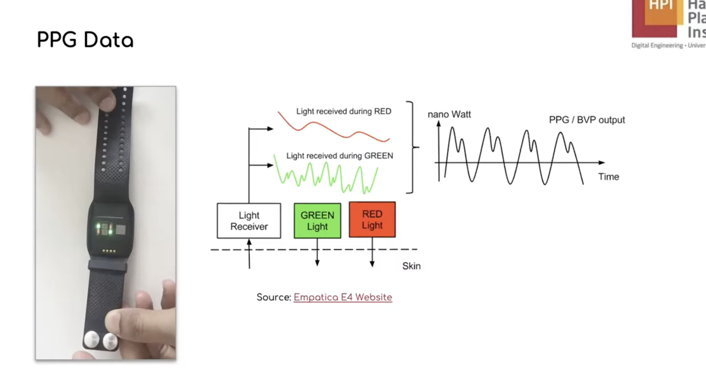

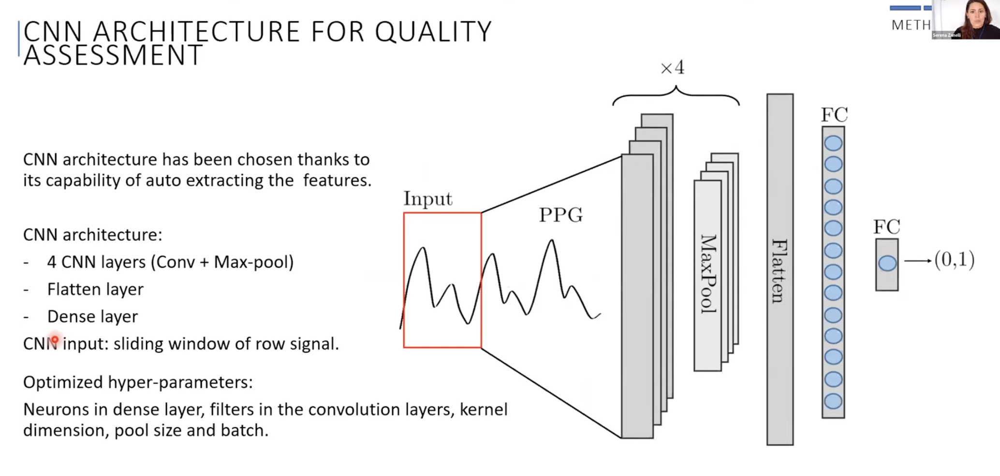

## Signal Processing

The SignalProcessing folder is the main implementation focused part of the project. It studies wearable PPG and ECG data from the PPG Field Study dataset, explains the dataset structure, prepares heart rate prediction windows, builds baseline and neural models, and documents several artifact removal methods for noisy wrist PPG signals.

The dataset notes explain how the PPG Field Study data is organized across 15 subjects. Each subject has synchronized wrist and chest recordings. The wrist device provides BVP, accelerometer, electrodermal activity, and temperature signals. The chest device provides ECG, respiration, accelerometer, and other physiological channels. ECG is treated as the ground truth source for heart rate labels, while wrist BVP and wrist accelerometer data are used as model inputs.

The data processing workflow explains the sampling rates and alignment. Wrist BVP is sampled at 64 Hz, wrist accelerometer at 32 Hz, activity labels at 4 Hz, ECG at 700 Hz, and heart rate labels at 0.5 Hz. The notes describe how each label corresponds to a window of signal data, how R peaks from ECG are used to derive heart rate, and why synchronization is needed between the chest sensor and the wrist device.

The heart rate modeling notebook predicts heart rate in beats per minute from wrist PPG and wrist accelerometer windows. ECG is not used as an input because it is the ground truth source. The prediction task uses 8 second windows with a 2 second shift. Each example contains 512 BVP samples and 256 accelerometer samples. For neural sequence models, BVP is downsampled to align with accelerometer data, producing inputs with 256 time steps and 4 channels consisting of BVP, ACC x, ACC y, and ACC z.

The modeling workflow begins with engineered features from BVP and accelerometer windows. BVP features include mean, standard deviation, minimum, maximum, peak to peak range, mean absolute value, RMS energy, and dominant frequency. Accelerometer features are computed for each axis and for acceleration magnitude. These features are used for Ridge Regression, Random Forest Regression, Gradient Boosting Regression, and a feature based MLP.

The project also tests raw sequence neural models for heart rate prediction. A 1D CNN learns local signal patterns from the aligned BVP and accelerometer channels. A bidirectional LSTM learns temporal dependencies across each 8 second window. A Transformer model uses self attention to focus on useful time regions inside the signal. Results are compared with MAE, RMSE, and R squared, with MAE in beats per minute treated as the main performance metric.

The artifact removal notes document the major noise sources that affect wrist PPG. These include motion artifacts, pressure artifacts, loose band coupling, ambient light interference, temperature drift, sweat and moisture effects, skin tone and tattoo related bias, venous pulsation, respiration effects, muscle and tendon movement, electromagnetic interference, and posture based hydrostatic changes. These artifacts can overlap in real use, which makes wrist PPG denoising a difficult signal processing problem.

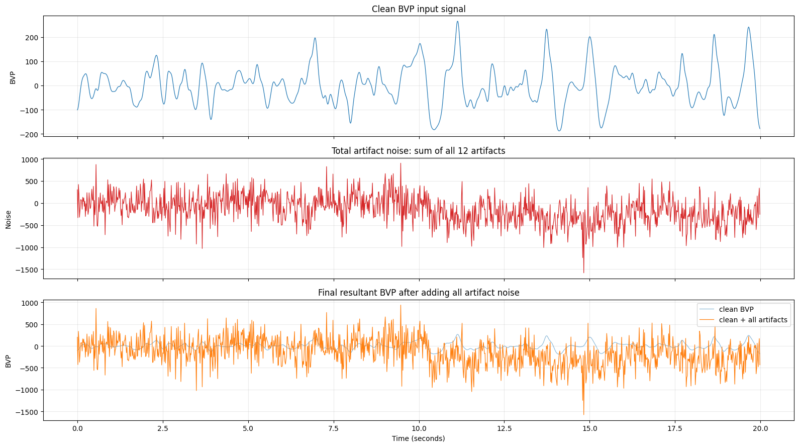

The artifact removal pipeline uses clean wrist BVP windows and adds synthetic artifacts to create noisy input signals. Each BVP window is 2 seconds long and contains 128 samples. Activity windows are used to modulate motion related artifact strength. The final denoising dataset contains noisy BVP input windows, clean BVP targets, and heart rate labels that are kept with the data but not used for the denoising objective. Neural methods use training set statistics for standardization and are evaluated using MSE and MAE against the clean target signal.

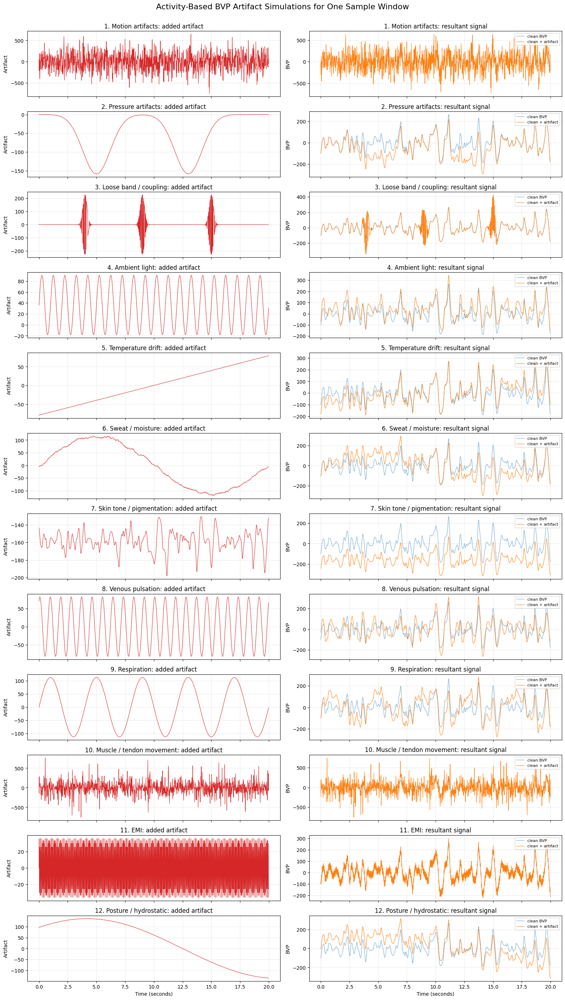

The first denoising method is a classical EMD and LMS adaptive filtering pipeline. Empirical Mode Decomposition separates a noisy signal into intrinsic mode functions. Noisy components are identified using zero crossing rate, and LMS adaptive filtering is then used to cancel estimated noise. The notes also include EEMD and CEEMDAN style variants using noise assisted decomposition.

The second denoising method is CycleGAN for unpaired signal translation. It uses one generator to map noisy signals to clean signals and another generator to map clean signals back to noisy signals. Cycle consistency, identity loss, and adversarial loss are used together so the model can learn signal domain translation even without strictly paired examples.

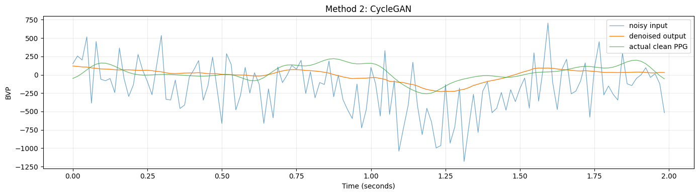

The third method is FCGAN, a paired fully convolutional conditional GAN. Its generator predicts the noise residual and subtracts it from the noisy signal. Its discriminator receives noisy and clean or generated signal pairs, making it closer to a Pix2Pix style denoising setup for one dimensional PPG windows.

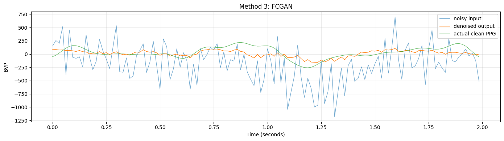

The fourth method is a Vector Quantised Variational Autoencoder. The VQVAE encoder compresses the noisy signal into a latent sequence, snaps each latent vector to a learned codebook entry, and decodes the quantised representation into a denoised signal. This method studies whether a discrete bottleneck can preserve clean PPG structure while suppressing artifact patterns.

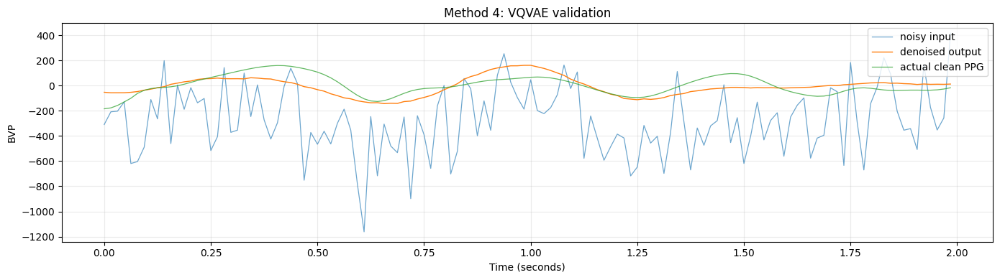

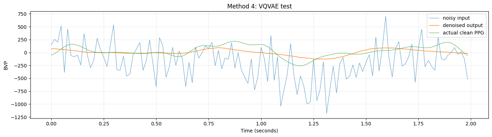

The fifth method is a 1D U Net. It uses an encoder decoder structure with skip connections so that local waveform details can pass around the bottleneck. This is useful for PPG because preserving peak shape and timing is important when recovering clean pulse morphology from noisy windows.

The sixth method is DPNet with bidirectional Mamba style selective state space blocks. This architecture processes the signal forward and backward through sequence modeling layers and blends the model output with the original noisy input using a learnable weighted residual. It is designed to model temporal structure in the PPG window while still retaining useful information from the measured signal.

The artifact removal comparison places the classical DSP method, CycleGAN, FCGAN, VQVAE, 1D U Net, and DPNet under the same denoising objective. The neural methods share the same train, validation, and test split, use the same standardization strategy, and are evaluated on held out data using MSE and MAE. Together, this part of the project turns the repository from basic time series notes into an applied wearable signal processing study.
